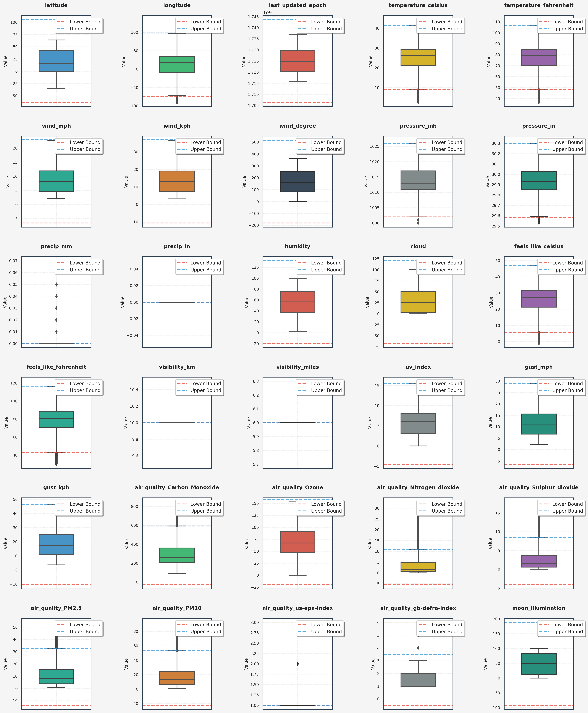
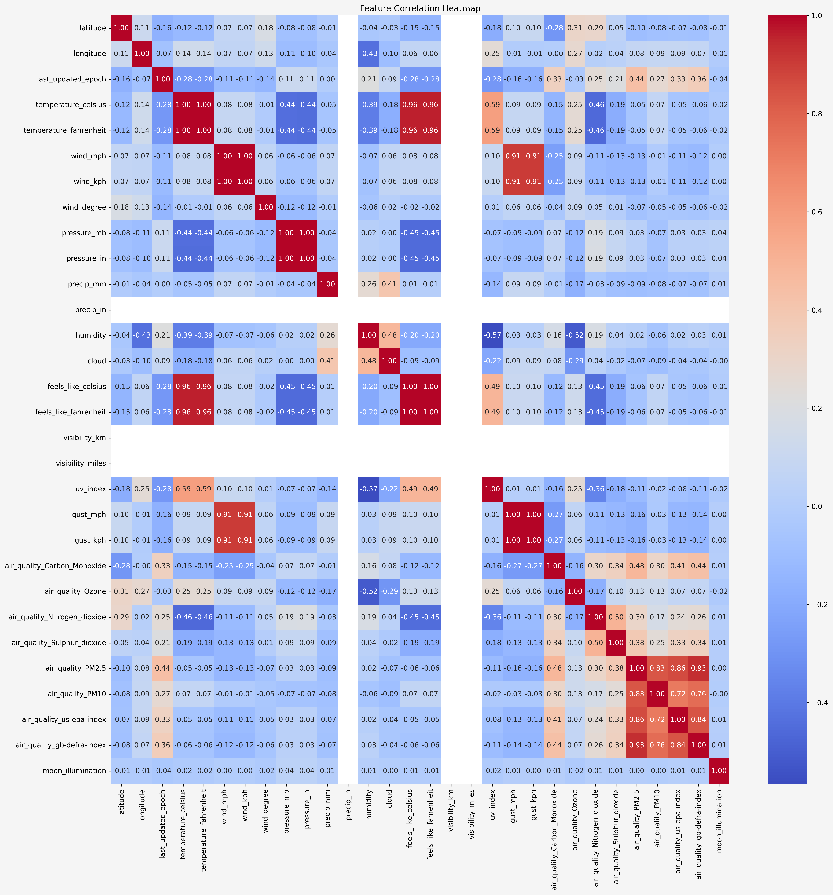
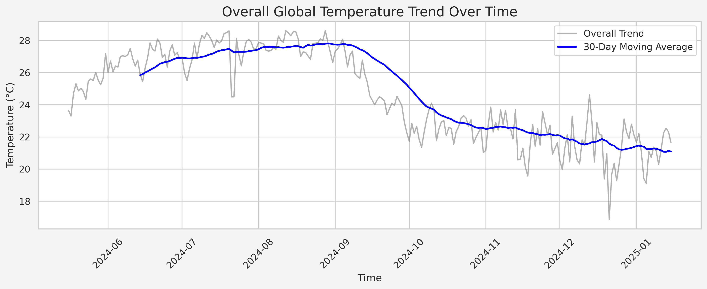
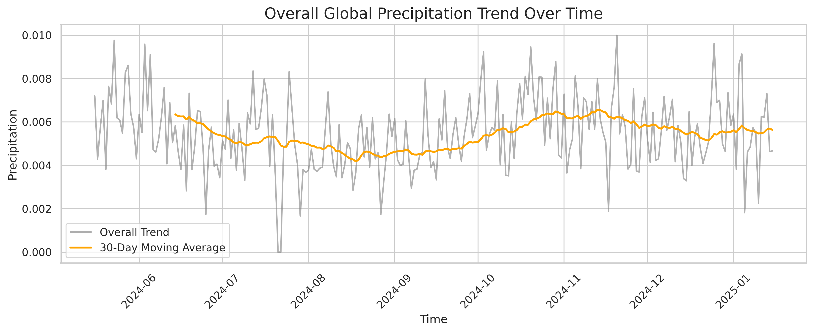
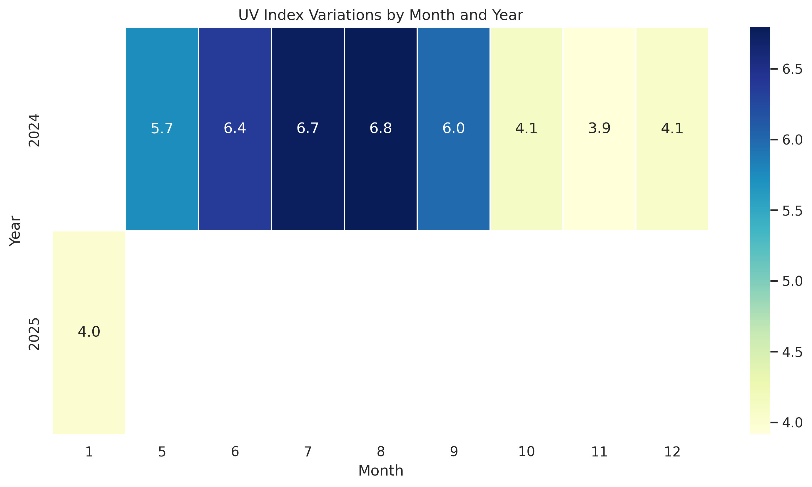
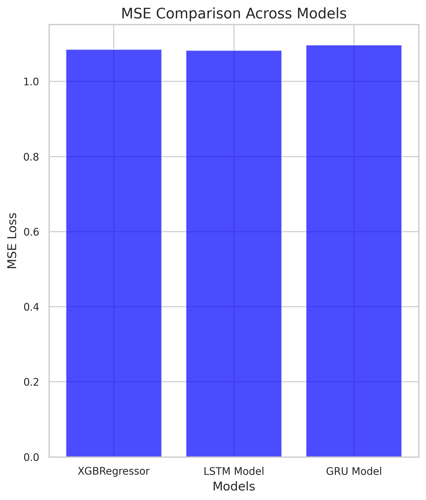
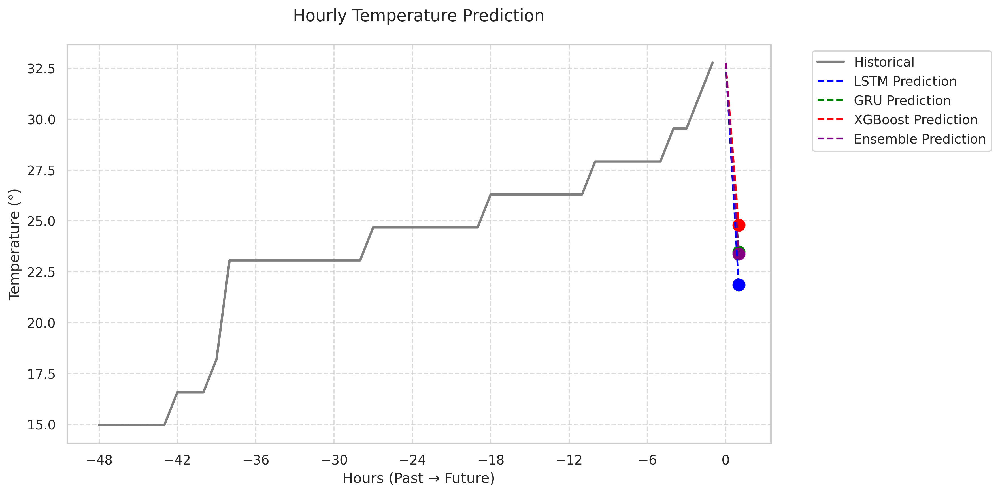

# Weather Analysis and Temperature Prediction

## PM Accelerator Mission
By making industry-leading tools and education available to individuals from all backgrounds, we level the playing field for future PM leaders. This is the PM Accelerator motto, as we grant aspiring and experienced PMs what they need most – Access. We introduce you to industry leaders, surround you with the right PM ecosystem, and discover the new world of AI product management skills.

## Overview
This project analyzes weather data and implements machine learning models for temperature prediction. It includes data preprocessing, exploratory data analysis, and the implementation of various deep learning and machine learning models (LSTM, GRU, and XGBoost) for temperature forecasting.

## Installation
1. Clone this repository
2. Install required packages:
```bash
pip install -r requirements.txt
```

## Data Processing Pipeline

### 1. Data Cleaning & Preprocessing
- Handles missing values
- Removes duplicates
- Processes infinity values
- Performs outlier detection using IQR method
  - Original dataset: 47,357 rows × 41 columns
  - After outlier removal: 20,114 rows × 41 columns

#### Outlier Analysis
This process involves detecting and removing outliers using the IQR (Interquartile Range) method, followed by boxplot visualization to understand the cleaned dataset.


### 2. Exploratory Data Analysis (EDA)

#### Correlation Analysis


#### Daily Global Weather Trends 


#### Daily Global Precipitation Trends


#### UV Index Analysis


### 3. Feature Engineering
- Converts categorical variables to numerical format:
  - country
  - location_name
  - condition
  - moon phase
  - wind direction
- Time feature preprocessing into numerical data
- Data normalization using RobustScaler

### 4. Data Preprocessing
- Y Target : 'temperature celsius'
- Train-validation split
- Sequential data preparation using sliding windows
- Input sequence processing for time series models

## Models
- Multivariate Model: The model uses multiple input features.
- n_steps_in = 120: The input sequence spans 120 hours (5 days of hourly data).
- n_steps_out = 1: The model predicts one step ahead (the next hour).

### Implemented Models
1. **LSTM Model**
   - Architecture: LSTM layer (32 units) + Dense output layer
   - Optimizer: Adam
   - Loss function: MSE
   - Callbacks: Early stopping

2. **GRU Model**
   - Similar to LSTM architecture
   - Uses GRU layer instead of LSTM
   - Includes early stopping

3. **XGBoost Model**
   - Configuration:
     - 100 estimators
     - Max depth: 6
     - Learning rate: 0.1
     - Subsample ratio: 0.8

### Model Comparison
| Model       | MSE    | MAE    |
|-------------|--------|--------|
| LSTM Model  | 1.0825 | 0.8362 |
| XGBRegressor| 1.0855 | 0.8421 |
| GRU Model   | 1.0969 | 0.8436 |



## Results
The models can predict temperature for the next hour:
- LSTM: 21.86°C
- GRU: 23.48°C
- XGBoost: 24.80°C
- Ensemble Average: 23.38°C

